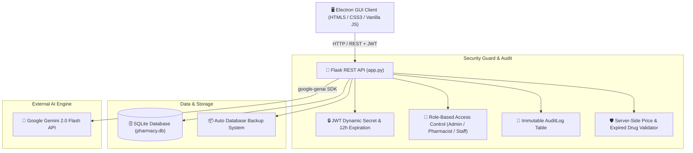

# 🏥 Smart Stock Pharmacy Management System

[](https://python.org)
[](https://flask.palletsprojects.com/)
[](https://www.electronjs.org/)
[](https://ai.google.dev/)
[](https://flask-jwt-extended.readthedocs.io/)
[](LICENSE)

> **Enterprise-Grade, Secure, AI-Powered Pharmacy Management System**  
> Built with **Electron**, **Python Flask**, **SQLite**, and **Google Gemini AI**. Designed for high-performance point-of-sale (POS) billing, automated FEFO inventory management, clinical AI drug safety checks, strict RBAC authorization, and CDSCO/FDA audit compliance.

---

## 🌟 Key System Features

### 💳 POS Billing & Thermal Invoicing
- **Instant Search & Autocomplete**: Real-time medicine lookup by name, category, box, or batch.
- **🔥 FEFO Clearance Pricing**: Automated First-Expired, First-Out (FEFO) clearance discount calculation (15%–25% off) for near-expiry medicines to prevent stock loss.
- **🚫 Expired Drug Blockout**: Automatic server-side rejection prevents dispensing any expired medications.
- **🧾 Dual Receipt Checkout**: Supports both standard PDF invoice generation and compact ESC/POS thermal receipt printing.
- **🎁 Customer Loyalty Program**: Earn 1 point per ₹100 spent; redeem points instantly at checkout.

### 🛡️ Enterprise Security & Regulatory Compliance
- **Dynamic JWT Secret**: Auto-generates a persistent 64-byte random key stored in `data/.jwt_secret`.
- **Session Lifecycle**: 12-hour session expiration with automatic logout on token expiry.
- **Registration Protection**: `/api/register` restricted exclusively to `admin` accounts (unlocked only during initial setup).
- **Strict Server-Side Price Calculations**: Invoice totals recalculated on the backend to prevent price tampering or negative total exploits.
- **Role-Based Access Control (RBAC)**: Fine-grained `@role_required` guards for Admin, Pharmacist, and Staff.
- **Immutable Audit Logging**: Every price edit, stock addition, deletion, user creation, and sale generates an entry in the `AuditLog` table.
- **Electron RCE Protection**: `contextIsolation: true` and `nodeIntegration: false` in `main.js`.

### 🤖 Clinical AI Suite (Google Gemini 2.0 Flash)
- **⚠️ AI Drug Interaction Checker**: Analyzes active cart items against known patient allergies/conditions for severe drug interactions.
- **🧬 Anatomy Symptom Matcher**: Interactive anatomical body map recommending the most appropriate in-stock medication based on symptoms.
- **📷 Vision OCR Scanner**: Upload invoice tables or prescription photos to automatically extract items into JSON and populate inventory/billing.
- **💬 Clinical Pharmacist Assistant**: Natural-language chatbot providing dosage guidelines, side effects, and alternative drug recommendations.

---

## 📐 System Architecture



---

## 🗄️ Database Schema Summary

| Table | Description | Key Fields |
|---|---|---|
| `user` | System accounts & credentials | `username`, `password` (Werkzeug Hash), `role` (`admin`/`pharmacist`/`staff`) |
| `medicine` | Inventory & batch details | `name`, `batch_number`, `box_number`, `quantity`, `price`, `expiry_date` |
| `sale` | Complete billing records | `customer_name`, `doctor_name`, `discount`, `total_amount`, `items` (JSON) |
| `supplier` / `supplier_bill` | Purchasing & Accounts | `supplier_name`, `bill_number`, `total_amount`, `paid_amount`, `payment_status` |
| `patient` / `customer_loyalty` | CRM & Refill tracking | `name`, `phone`, `email`, `medical_history`, `points` |
| `doctor_profile` / `prescription` | Telemedicine | `doctor_name`, `specialty`, `diagnosis`, `items`, `status` |
| `audit_log` | Security audit trail | `timestamp`, `username`, `action`, `target`, `details`, `ip_address` |

---

## 🔑 Default Credentials (Initial Setup)

| Role | Username | Default Password | Access Level |
|------|----------|------------------|--------------|
| **Admin** | `admin` | `password123` | Full Control (Users, Inventory, Sales, Audit Logs, Backup) |
| **Pharmacist** | `pharmacist` | `pass123` | POS Billing, Inventory Addition/Edit, AI Suite |
| **Staff** | `staff` | `pass123` | POS Billing, Patient CRM, Telemedicine Lookup |

---

## 🚀 Quick Start Guide

### 1. Launching Desktop App (Windows 1-Click)
- **1-Click Silent Launch**: Double-click **`Smart Pharmacy Desktop.vbs`** in the root directory.
- **Standalone Package**: Double-click **`dist/win-unpacked/Smart Pharmacy Management System.exe`**.

### 2. Development Setup
```bash
# Install Python backend dependencies
cd backend
pip install -r requirements.txt

# Start Python backend server
python app.py

# Launch Electron desktop interface
npm start
```
> Access web API interface directly at **[http://127.0.0.1:5000](http://127.0.0.1:5000)**.

---

## 📡 REST API Quick Reference

| Endpoint | Method | Role Required | Description |
|---|---|---|---|
| `/api/login` | `POST` | Public | Authenticate user & issue JWT token |
| `/api/register` | `POST` | Admin | Register new system user |
| `/api/users` | `GET` | Admin | List all registered accounts |
| `/api/inventory` | `GET`, `POST` | Pharmacist / Admin | List or add medicines |
| `/api/inventory/<id>` | `PUT`, `DELETE` | Pharmacist / Admin (Delete=Admin) | Update or delete medicine |
| `/api/sales` | `POST` | Staff / Pharmacist / Admin | Process sale with server price validation |
| `/api/audit-logs` | `GET` | Admin | Retrieve security audit history |

---

## 📜 License

Distributed under the MIT License. See `LICENSE` for details.
