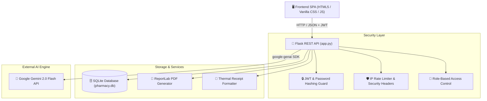

# 🏥 Renuka Medicals — Smart Pharmacy Management System

[](https://python.org)
[](https://flask.palletsprojects.com/)
[](https://ai.google.dev/)
[](https://flask-jwt-extended.readthedocs.io/)
[](LICENSE)

> An **enterprise-grade, AI-powered Pharmacy Management System** built with Python Flask, SQLite, and Google Gemini API. Designed for high-performance point-of-sale (POS) billing, automated FEFO inventory management, clinical AI drug safety checks, and patient CRM tracking.

---

## 🌟 Key Features

### 💳 POS Billing & Thermal Invoicing
- **Instant Search & Autocomplete**: Real-time medicine lookup by name, category, or barcode batch.
- **🔥 FEFO Clearance Auto-Discounts**: Automated First-Expired, First-Out (FEFO) clearance pricing (15%–25% off) for near-expiry medicines to prevent stock loss.
- **🧾 Dual Receipt Checkout**: Supports both standard **ReportLab PDF invoice generation** and compact **80mm ESC/POS Thermal Receipt printing**.
- **🎁 Customer Loyalty Program**: Earn 1 point per ₹100 spent; redeem points instantly at checkout.

### 🤖 Clinical AI Suite (Google Gemini 2.0 Flash)
- **⚠️ AI Drug Interaction Checker**: Analyzes active cart items against known patient allergies/conditions for severe drug-drug interactions.
- **🧬 Anatomy Symptom Matcher**: Interactive anatomical body map recommending the most appropriate in-stock medication based on symptoms.
- **📷 Vision OCR Scanner**: Upload invoice tables or prescription photos to automatically extract items into JSON and populate inventory/billing.
- **💬 Clinical Pharmacist Assistant**: Natural-language chatbot providing dosage guidelines, side effects, and alternative drug recommendations.
- **🛡️ Offline Fallback Protection**: Graceful fallback responses if the network or API key is unavailable.

### ⚡ Power Tools & Modern UX
- **⌨️ Global Command Palette (`Ctrl + K`)**: Spotlight search overlay to jump anywhere in the app or search medicines instantly.
- **🌙 Light / Dark Theme Switcher**: Toggle between Clinical Dark Glassmorphism and Ultra-Clean Light Mode.
- **✨ Ambient Medical Mesh Canvas**: Low-overhead, sleek ambient background animation built with Vanilla JS Canvas.

### 🔒 Enterprise Security Architecture
- **Password Hashing**: Passwords stored using PBKDF2 with SHA-256 via Werkzeug.
- **JWT Authentication**: 12-hour expiration JWT token authorization on all 33 data endpoints.
- **Role-Based Access Control (RBAC)**: `@role_required("admin")` decorators protecting administrative user management routes.
- **IP Rate Limiting**: Brute-force protection capping login (10/min) and registration (5/min) per IP.
- **OWASP Security Headers**: Automatic `X-Frame-Options: DENY`, `X-Content-Type-Options: nosniff`, and `Content-Security-Policy` header injection.
- **File Upload Guard**: Strict extension (`.png`, `.jpg`, `.jpeg`, `.webp`) and 16 MB payload caps.

---

## 📐 System Architecture



---

## 🛠️ Technology Stack

| Component | Technology Used |
|-----------|------------------|
| **Backend Core** | Python 3.12+, Flask 2.3 |
| **Database** | SQLite3 via Flask-SQLAlchemy |
| **Authentication** | Flask-JWT-Extended, Werkzeug Security |
| **AI SDK** | `google-genai` (Gemini 2.0 Flash) |
| **PDF & Reports** | ReportLab 4.x, XlsxWriter |
| **QR Code System** | `qrcode`, `html5-qrcode`, `pako` |
| **Desktop Window** | PyWebView 4.x |
| **Frontend** | HTML5, Vanilla CSS3 (Custom Glassmorphism), Inter Font |

---

## 🚀 Quick Start Guide

### Prerequisites
- Python 3.10+ installed
- Google Gemini API key (Get one free at [Google AI Studio](https://aistudio.google.com/))

### 1. Clone the Repository
```bash
git clone https://github.com/YOUR_USERNAME/smart-stock-pharmacy-management.git
cd smart-stock-pharmacy-management
```

### 2. Install Dependencies
```bash
pip install flask flask-sqlalchemy flask-cors flask-jwt-extended google-genai reportlab xlsxwriter qrcode pillow pywebview python-dotenv
```

### 3. Configure Environment Variables
Create a `.env` file in the project root:
```env
GEMINI_API_KEY=your_actual_gemini_api_key_here
JWT_SECRET=your_custom_jwt_secret_key
DEBUG=False
```

### 4. Launch Application
```bash
python backend/app.py
```
> The desktop application window will open automatically. You can also visit **[http://localhost:5000](http://localhost:5000)** in any browser.

---

## 🔑 Default Seed Credentials

| Role | Username | Default Password | Access Level |
|------|----------|------------------|--------------|
| **Admin** | `admin` | `password123` | Full Access (User Management, Inventory, Sales, Reports) |
| **Pharmacist** | `pharmacist` | `pass123` | POS Billing, Inventory Edit, AI Assistant |
| **Staff** | `staff` | `pass123` | POS Billing & Patient History |

---

## 📡 REST API Reference

| Endpoint | Method | Protection | Description |
|----------|--------|------------|-------------|
| `/api/login` | `POST` | Public (Rate-Limited) | Authenticate user & receive JWT token |
| `/api/register` | `POST` | Admin Only | Register new staff/admin user |
| `/api/inventory` | `GET`, `POST` | JWT Protected | Fetch or add medicines |
| `/api/inventory/<id>` | `PUT`, `DELETE` | JWT / Admin | Update or delete medicine |
| `/api/sales` | `GET`, `POST` | JWT Protected | View sales history or create new sale |
| `/api/generate-invoice` | `POST` | JWT Protected | Generate downloadable ReportLab PDF invoice |
| `/api/generate-thermal-receipt` | `POST` | JWT Protected | Generate 80mm ESC/POS thermal receipt |
| `/api/check-interactions` | `POST` | JWT Protected | Run Gemini AI drug-drug interaction check |
| `/api/anatomy-symptom` | `POST` | JWT Protected | Recommend stock medicine based on symptom |
| `/api/vision-ocr` | `POST` | JWT Protected | AI Vision OCR invoice image scanner |
| `/api/vision-prescription` | `POST` | JWT Protected | AI Vision OCR prescription scanner |
| `/api/chat` | `POST` | JWT Protected | Clinical Pharmacist AI Chatbot |
| `/api/refill-alerts` | `POST` | JWT Protected | Fetch patient chronic refill reminders |

---

## 🤝 Contributing

Contributions are welcome! Follow these steps to contribute:
1. Fork the Project
2. Create your Feature Branch (`git checkout -b feature/AmazingFeature`)
3. Commit your Changes (`git commit -m 'Add some AmazingFeature'`)
4. Push to the Branch (`git push origin feature/AmazingFeature`)
5. Open a Pull Request

---

## 📜 License

Distributed under the MIT License. See `LICENSE` for details.
